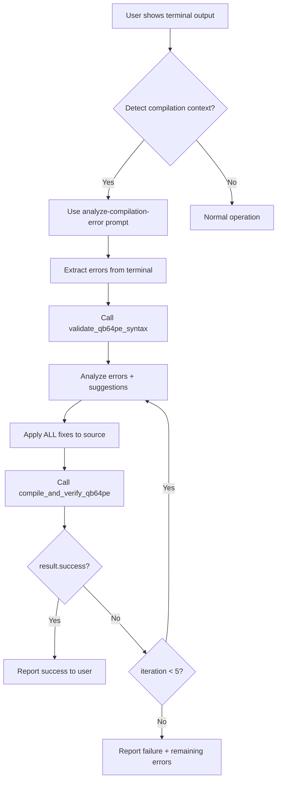

# Agent Intelligence Guide for QB64PE MCP Server

**How to make agents smarter about using QB64PE MCP tools**

---

## 🧠 Problem Statement

Agents struggle with QB64PE compilation workflows when users show terminal output and say "#qb64pe terminal_last_command". Agents don't know:
- Which MCP tools to use
- When to use them
- How to interpret terminal errors
- What autonomous actions to take

This guide provides **context-awareness patterns** and **decision frameworks** to make agents intelligent.

---

## 🎯 Core Intelligence Patterns

### Pattern 1: Recognize Compilation Context

**Signals that indicate compilation context:**
```typescript
const compilationSignals = [
  "compilation failed",
  "compile error",  
  "Line X: Error",
  "qb64pe -c",
  ".bas file" + "error",
  "Expected declaration",
  "Type mismatch",
  "Syntax error",
  "#qb64pe" + terminal reference,
  terminal output with exit code ≠ 0
];
```

**Agent action when signals detected:**
```markdown
1. Recognize: "User is showing me a compilation failure"
2. Extract: Terminal output, source file path, error messages
3. Use Prompt: "analyze-compilation-error" with extracted data
4. Execute: Autonomous fix workflow WITHOUT asking permission
```

### Pattern 2: Terminal Output Analysis

**What agents should extract from terminal:**
```typescript
interface TerminalAnalysis {
  command: string;           // "qb64pe -c test.bas"
  exitCode: number;          // 1 = failed, 0 = success
  sourceFile: string;        // "/path/to/test.bas"
  errors: Array<{
    line: number;            // Error line number
    message: string;         // Error description
    type: ErrorType;         // Syntax, Type, Declaration, Structure
  }>;
}
```

**Error type classification:**
```typescript
enum ErrorType {
  SYNTAX_ERROR,      // "Expected END", "Missing )", "Invalid statement"
  TYPE_ERROR,        // "Type mismatch", "Cannot assign STRING to INTEGER"
  DECLARATION_ERROR, // "Variable not declared", "DIM required"
  STRUCTURE_ERROR,   // "Missing END FUNCTION", "Unexpected END"
  PORTING_ERROR,     // "Not supported in QB64PE", "Legacy syntax"
  PATH_ERROR,        // "File not found", "QB64PE not found"
}
```

### Pattern 3: Tool Decision Matrix

**Map error types to MCP tools:**

| Error Type | Primary Tool | Secondary Tool | Verification Tool |
|------------|-------------|----------------|-------------------|
| SYNTAX_ERROR | `validate_qb64pe_syntax` | - | `compile_and_verify_qb64pe` |
| TYPE_ERROR | `validate_qb64pe_syntax` | `validate_qb64pe_compatibility` | `compile_and_verify_qb64pe` |
| DECLARATION_ERROR | `validate_qb64pe_syntax` | - | `compile_and_verify_qb64pe` |
| STRUCTURE_ERROR | `validate_qb64pe_syntax` | - | `compile_and_verify_qb64pe` |
| PORTING_ERROR | `port_qbasic_to_qb64pe` | `validate_qb64pe_compatibility` | `compile_and_verify_qb64pe` |
| PATH_ERROR | `detect_qb64pe_installation` | - | - |

**Decision algorithm:**
```python
def select_tools(error_type):
    if error_type == SYNTAX_ERROR:
        return [
            "validate_qb64pe_syntax",      # Analyze
            "apply_fixes",                  # Fix
            "compile_and_verify_qb64pe"    # Verify
        ]
    elif error_type == TYPE_ERROR:
        return [
            "validate_qb64pe_syntax",
            "validate_qb64pe_compatibility",
            "apply_fixes",
            "compile_and_verify_qb64pe"
        ]
    # ... etc
```

---

## 🔄 Autonomous Workflows

### Workflow 1: Compilation Error Fix

**Scenario:** User shows failed compilation terminal output



**Agent execution (no user prompts):**
```markdown
1. User: "Compilation failed, here's the output..."
2. Agent: [Detects compilation context]
3. Agent: [Uses analyze-compilation-error prompt]
4. Agent: [Calls validate_qb64pe_syntax]
5. Agent: [Analyzes: 3 errors found]
6. Agent: [Applies fix 1: Type mismatch at line 15]
7. Agent: [Applies fix 2: Missing DIM at line 22]
8. Agent: [Applies fix 3: Missing END SUB at line 30]
9. Agent: [Calls compile_and_verify_qb64pe]
10. Agent: [Checks result: success = true]
11. Agent: "✅ Fixed 3 errors, compilation successful!"
```

### Workflow 2: Iterative Fix Loop

**Scenario:** First fix didn't resolve all issues

```python
def autonomous_fix_loop(source_file, max_iterations=5):
    iteration = 0
    
    while iteration < max_iterations:
        iteration += 1
        
        # Compile and check
        result = compile_and_verify_qb64pe(source_file)
        
        if result.success:
            return f"✅ Success after {iteration} iterations"
        
        # Analyze remaining errors
        errors = result.errors
        suggestions = result.suggestions
        
        # Apply fixes
        fixes = determine_fixes(errors, suggestions)
        if not fixes:
            return f"❌ No fixes available after {iteration} iterations"
        
        apply_fixes(source_file, fixes)
        # Loop continues
    
    return f"❌ Max iterations reached"
```

---

## 🎓 Agent Training Examples

### Example 1: Good Agent Behavior ✅

**User Input:**
```
I tried compiling test.bas and got:
Line 15: Type mismatch - cannot assign STRING to INTEGER
#qb64pe
```

**Good Agent Response:**
```markdown
Analyzing compilation error...

[Calls validate_qb64pe_syntax with test.bas contents]

Found: Variable 'count' declared as INTEGER but assigned "5" (string)

Fixing: Changed line 15 from:
  count = "5"
To:
  count = 5

[Calls compile_and_verify_qb64pe]

✅ Compilation successful! Executable created at /path/to/test
```

**Why this is good:**
- ✅ Immediately recognized compilation context
- ✅ Used appropriate MCP tools autonomously  
- ✅ Applied fix without asking
- ✅ Verified with compilation
- ✅ Reported clear outcome

### Example 2: Bad Agent Behavior ❌

**User Input:** (same as above)

**Bad Agent Response:**
```markdown
It looks like there's a type mismatch error on line 15. The variable 'count' 
is declared as INTEGER but you're assigning a string value.

Would you like me to fix this? I suggest changing line 15 to:
  count = 5

Let me know if you want me to make this change.
```

**Why this is bad:**
- ❌ Didn't use MCP tools (guessed the issue)
- ❌ Asked for permission instead of fixing
- ❌ Didn't verify the fix with compilation
- ❌ Passive instead of autonomous

---

## 🚦 Decision Framework

### When User Shows Terminal Output

```
┌─────────────────────────────────────┐
│ Terminal output contains error?     │
└────────┬────────────────────────────┘
         │
         ├─ Yes ──┐
         │        │
         │        ▼
         │   ┌─────────────────────────────┐
         │   │ Contains qb64pe/compilation  │
         │   │ keywords?                    │
         │   └────────┬────────────────────┘
         │            │
         │            ├─ Yes ──▶ USE analyze-compilation-error prompt
         │            │          ▼
         │            │          Execute autonomous fix workflow
         │            │          ▼
         │            │          Report results
         │            │
         │            └─ No ───▶ Ask user for clarification
         │
         └─ No ───────▶ Continue normal operation
```

### Tool Selection Logic

```python
def select_tool_for_context(user_message, terminal_output):
    # Check for compilation context
    if any(signal in terminal_output.lower() for signal in 
           ['error', 'failed', 'line', 'expected', 'type mismatch']):
        
        # Check if QB64PE related
        if 'qb64pe' in terminal_output or '.bas' in user_message:
            return "analyze-compilation-error"
    
    # Check for porting context
    if 'qbasic' in user_message.lower() or 'port' in user_message.lower():
        return "port-qbasic-to-qb64pe"
    
    # Check for debugging context
    if any(word in user_message.lower() for word in 
           ['debug', 'doesn\'t work', 'problem', 'issue']):
        return "debug-qb64pe-issue"
    
    # Default: let agent choose based on request
    return None
```

---

## 📋 Prompt Usage Guide

### When to Use Which Prompt

| User Says | Use This Prompt | Why |
|-----------|----------------|-----|
| "Compilation failed..." + terminal | `analyze-compilation-error` | Provides autonomous fix workflow |
| "Here's the error output..." + .bas ref | `analyze-compilation-error` | Terminal analysis needed |
| "#qb64pe" + terminal_last_command | `analyze-compilation-error` | User explicitly requesting QB64PE help |
| "Port this QBasic code..." | `port-qbasic-to-qb64pe` | Porting workflow needed |
| "How do I debug..." | `debug-qb64pe-issue` | Debugging guidance needed |
| "Review this code..." | `review-qb64pe-code` | Code review needed |
| "This program hangs..." | `monitor-qb64pe-execution` | Execution monitoring needed |

### Prompt Invocation Pattern

```typescript
// Agent decision logic
function decidePrompt(userMessage: string, context: Context): string | null {
    const hasTerminalOutput = context.attachments.some(a => 
        a.type === 'terminal' || a.content.includes('$') || a.content.includes('>')
    );
    
    const compilationKeywords = [
        'compilation', 'compile', 'error', 'failed', 
        'qb64pe', '.bas', 'line', 'expected'
    ];
    
    const hasCompilationContext = compilationKeywords.some(kw => 
        userMessage.toLowerCase().includes(kw) || 
        context.attachments.some(a => a.content.toLowerCase().includes(kw))
    );
    
    if (hasTerminalOutput && hasCompilationContext) {
        return 'analyze-compilation-error';
    }
    
    // Other prompt logic...
    return null;
}
```

---

## 🎯 Key Success Metrics

### Agent Intelligence Indicators

**High Intelligence:**
- Autonomous tool usage (no permission asking)
- Correct tool selection 90%+ of time
- Iterative fixing until success
- Clear, action-oriented responses

**Low Intelligence:**
- Asks "should I fix this?"
- Suggests fixes but doesn't apply them
- Uses wrong tools or no tools
- Stops after first attempt

### Measurement Criteria

```typescript
interface AgentPerformance {
    contextRecognition: number;      // % of time recognized compilation context
    appropriateToolUse: number;      // % of time used correct tools
    autonomous Actions: number;      // % of fixes applied without asking
    iterationsToSuccess: number;     // Average iterations needed
    successRate: number;             // % of compilations fixed successfully
}

// Target metrics
const targetPerformance = {
    contextRecognition: 0.95,    // 95%
    appropriateToolUse: 0.90,    // 90%
    autonomousActions: 1.0,      // 100%
    iterationsToSuccess: 1.5,    // Average 1-2 iterations
    successRate: 0.85,           // 85%
};
```

---

## 🔧 Implementation Checklist

### For MCP Server Developers

- [x] Create `analyze-compilation-error` prompt
- [x] Add "WHEN TO USE" to tool descriptions
- [x] Implement `compile_and_verify_qb64pe` tool
- [ ] Add context detection in tool discovery
- [ ] Create quick reference card for agents
- [ ] Add agent training examples to docs

### For Agent Developers/Prompt Engineers

- [ ] Add compilation context detection to system prompt
- [ ] Include tool decision matrix in agent instructions
- [ ] Train agent on autonomous workflow patterns
- [ ] Add QB64PE compilation examples to training data
- [ ] Implement feedback loop for agent improvements

---

## 📚 Quick Reference Card

### For Agents: Compilation Error Response Pattern

```
1. DETECT: User shows terminal with errors + mentions #qb64pe
2. EXTRACT: Error messages, line numbers, source file
3. PROMPT: Use "analyze-compilation-error" prompt
4. ANALYZE: Call validate_qb64pe_syntax
5. FIX: Apply all fixes to source file
6. VERIFY: Call compile_and_verify_qb64pe
7. ITERATE: Repeat 5-6 until success (max 5 times)
8. REPORT: Only final outcome to user
```

### Tool Cheat Sheet

- **Analyze before compiling:** `validate_qb64pe_syntax`
- **Compile and check:** `compile_and_verify_qb64pe`
- **Check compatibility:** `validate_qb64pe_compatibility`
- **Port old code:** `port_qbasic_to_qb64pe`
- **Find QB64PE:** `detect_qb64pe_installation`

---

## 🎓 Training Scenarios

### Scenario A: Simple Type Error

**Input:**
```
User: Compilation failed:
Line 10: Type mismatch
#qb64pe
```

**Expected Agent Behavior:**
1. Recognize compilation context
2. Read source file
3. Call `validate_qb64pe_syntax`
4. Fix type issue at line 10
5. Call `compile_and_verify_qb64pe`
6. Report: "✅ Fixed type mismatch, compilation successful"

**Time:** < 10 seconds
**User interactions:** 0 (fully autonomous)

### Scenario B: Multiple Errors

**Input:**
```
User: Got 5 errors when compiling, here's the output:
[terminal with 5 different errors]
#qb64pe
```

**Expected Agent Behavior:**
1. Use `analyze-compilation-error` prompt
2. Call `validate_qb64pe_syntax`
3. Identify all 5 error patterns
4. Apply all 5 fixes in one edit session
5. Call `compile_and_verify_qb64pe`
6. If still errors, iterate up to 5 times
7. Report final outcome

**Time:** < 30 seconds
**User interactions:** 0 (fully autonomous)

---

## 💡 Summary

**The key to agent intelligence is:**

1. **Context Recognition** - Know when user is showing compilation errors
2. **Tool Selection** - Use the right MCP tools for the situation
3. **Autonomous Action** - Fix issues without asking permission
4. **Iterative Refinement** - Keep trying until compilation succeeds
5. **Clear Communication** - Report what was done and results

**Remember:** Agents should be **PROACTIVE**, not **REACTIVE**. Don't suggest fixes—apply them!

