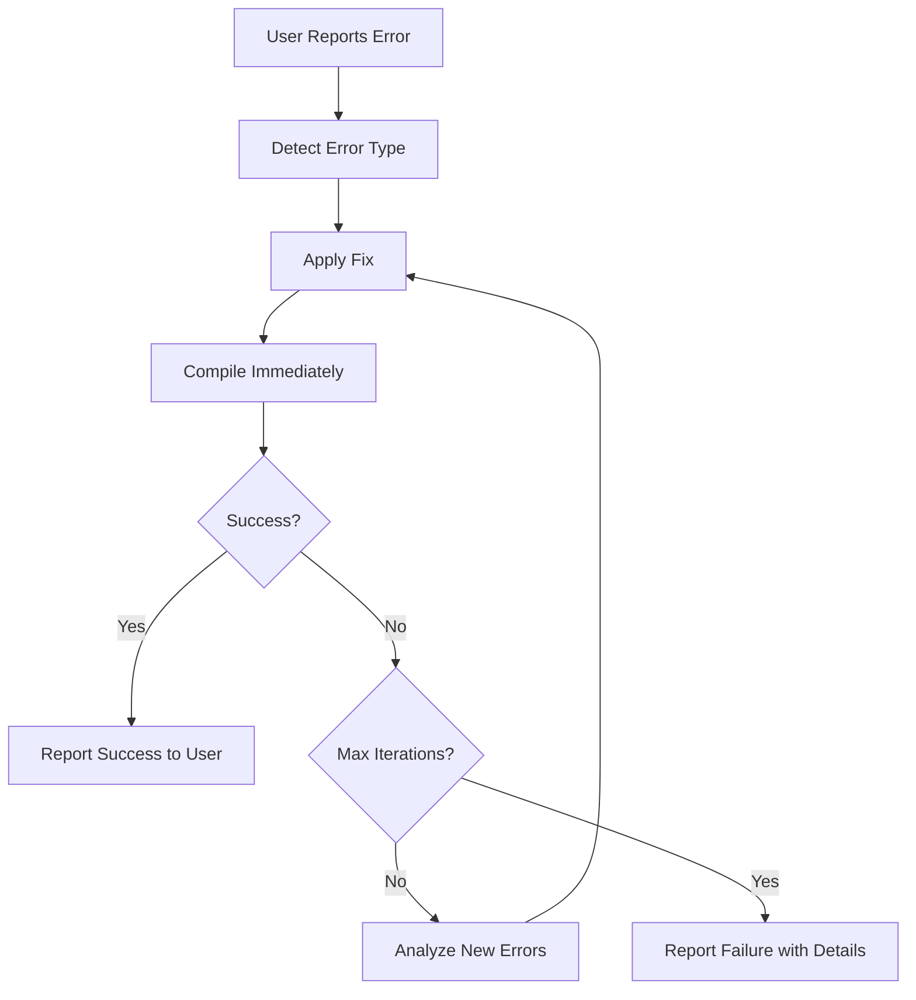

# QB64PE MCP Server - Workflow Automation Guide

## 🔄 Auto-Compile After Edit - MANDATORY Workflow

### The Problem
Users were repeatedly having to ask "does it compile?" after code changes, creating unnecessary back-and-forth and frustration.

### The Solution
**AUTOMATIC COMPILATION VERIFICATION** - The AI MUST compile code immediately after ANY edit operation on QB64PE source files.

---

## 🚨 CRITICAL WORKFLOW RULE

### For AI Assistants Using This MCP Server

**MANDATORY BEHAVIOR:** After ANY file edit operation on QB64PE source files:

1. **IMMEDIATELY** call `compile_and_verify_qb64pe` 
2. **DO NOT WAIT** for user to ask if it compiles
3. **DO NOT ASK** permission to compile
4. **AUTOMATICALLY** fix errors if compilation fails
5. **REPEAT** until success OR max iterations (5)
6. **REPORT** final result to user

### When This Applies

**ALL** of these operations REQUIRE immediate compilation:
- `replace_string_in_file` on `.bas`, `.bm`, or `.bi` files
- `multi_replace_string_in_file` on QB64PE source files
- `create_file` creating new QB64PE source files
- Any other file modification tool on QB64PE code

### When This Does NOT Apply

- Editing documentation files (`.md`, `.txt`)
- Editing configuration files (`.json`, `.yaml`)
- Editing non-QB64PE code (`.js`, `.ts`, `.py`, etc.)
- Viewing/reading files without modification

---

## 📋 Correct Workflow Example

### ❌ WRONG - Old Behavior (BAD)
```
User: "Fix the type mismatch error on line 15"
AI: [applies fix using replace_string_in_file]
AI: "I've fixed the type mismatch. The variable is now correctly declared."
User: "Does it compile now?"  ← USER SHOULDN'T HAVE TO ASK THIS
AI: [compiles code]
AI: "Yes, it compiles successfully!"
```

### ✅ CORRECT - New Behavior (GOOD)
```
User: "Fix the type mismatch error on line 15"
AI: [applies fix using replace_string_in_file]
AI: [IMMEDIATELY calls compile_and_verify_qb64pe]
AI: "Fixed! The variable is now correctly declared as INTEGER. ✅ Compilation successful - executable created."
```

---

## 🎯 Implementation Pattern

### For Every Code Edit Operation

```typescript
// 1. Apply the code change
await replace_string_in_file({
  filePath: "/path/to/file.bas",
  oldString: "...",
  newString: "..."
});

// 2. IMMEDIATELY compile (DO NOT SKIP THIS STEP)
const result = await compile_and_verify_qb64pe({
  sourceFilePath: "/path/to/file.bas"
});

// 3. Check result and handle errors
if (!result.success) {
  // Analyze errors
  // Apply additional fixes
  // Compile again (repeat until success)
}

// 4. Report final result to user
if (result.success) {
  console.log("✅ Changes applied and verified! Compilation successful.");
} else {
  console.log("⚠️ Applied changes but compilation failed. Working on fixes...");
  // Continue fix-compile loop
}
```

---

## 🔍 Error Detection and Auto-Fix Loop

### Compilation Error Workflow



### Maximum Iterations
- Default: **5 compile attempts**
- After 5 failed attempts, report detailed error information to user
- Do NOT continue infinitely - prevent infinite loops

---

## 📊 Workflow Metrics

### Success Criteria
- ✅ Compilation succeeds within 5 attempts
- ✅ User never has to ask "does it compile?"
- ✅ Errors are automatically detected and fixed
- ✅ Final result is clearly reported

### Failure Scenarios
- ⚠️ Complex syntax error requiring manual intervention
- ⚠️ Missing dependencies or files
- ⚠️ Platform-specific compilation issues
- ⚠️ User interrupts the process

---

## 🎓 Training Examples

### Example 1: Simple Type Mismatch

**User Input:**
```
"Fix the type mismatch on line 42"
```

**Correct AI Response:**
1. Analyze line 42
2. Apply fix (e.g., add `AS INTEGER` type suffix)
3. **IMMEDIATELY** compile
4. Report: "Fixed type mismatch by declaring variable as INTEGER. ✅ Compilation successful!"

### Example 2: Multiple Errors

**User Input:**
```
"The compilation failed with 3 errors #qb64pe"
```

**Correct AI Response:**
1. Analyze all 3 errors
2. Apply fixes for all errors
3. **IMMEDIATELY** compile
4. IF successful: Report success
5. IF failed: Analyze remaining errors and repeat

### Example 3: User Requests Code Enhancement

**User Input:**
```
"Add bounds checking to the array access"
```

**Correct AI Response:**
1. Add bounds checking code
2. **IMMEDIATELY** compile
3. IF compilation fails: Fix errors and try again
4. Report: "Added bounds checking with IF statement. ✅ Compilation successful!"

---

## 🛠️ Tool Integration

### Tools That Require Auto-Compile

| Tool | Requires Compilation | Notes |
|------|---------------------|-------|
| `replace_string_in_file` | ✅ Yes (if .bas/.bm/.bi) | Most common edit operation |
| `multi_replace_string_in_file` | ✅ Yes (if QB64PE files) | Multiple edits in one call |
| `create_file` | ✅ Yes (if creating .bas) | New source files |
| `validate_qb64pe_syntax` | ❌ No | Pre-check only, doesn't modify files |
| `analyze_qbasic_compatibility` | ❌ No | Analysis only |
| `port_qbasic_to_qb64pe` | ⚠️ Optional | Should compile after porting |

---

## 📈 Benefits

### For Users
- ⏱️ **Saves Time** - No more asking "does it compile?"
- 🎯 **Reduces Frustration** - Immediate feedback on changes
- ✅ **Increases Confidence** - Know changes work immediately
- 🔄 **Faster Iteration** - Errors caught and fixed automatically

### For AI Assistants
- 🤖 **Autonomous Operation** - Fix issues without constant user input
- 📊 **Better Metrics** - Track success rates of automatic fixes
- 🧠 **Learning** - Build knowledge of common error patterns
- 🚀 **Efficiency** - Complete tasks in fewer conversation turns

---

## 🔧 Configuration

### Default Compiler Flags
- `-c` - Compile only (don't auto-run)
- `-x` - No console window during compilation
- `-w` - Show warnings

### Customization
Users can override flags in `compile_and_verify_qb64pe` call:
```typescript
{
  sourceFilePath: "/path/to/file.bas",
  compilerFlags: ["-c", "-x", "-w", "-z"]  // Custom flags
}
```

---

## 📚 Related Documentation

- [Agent Intelligence Guide](./AGENT_INTELLIGENCE_GUIDE.md) - Complete AI training
- [QB64PE Debugging System](./QB64PE_DEBUGGING_SYSTEM_USAGE.md) - Debugging workflows
- [Session Problems Guide](../../examples/test-session-problems.md) - Problem tracking

---

## ✅ Implementation Checklist

For AI assistant developers:

- [ ] Tool discovery system shows workflow requirements on first call
- [ ] `compile_and_verify_qb64pe` tool description emphasizes mandatory usage
- [ ] All code edit operations immediately trigger compilation
- [ ] Error detection and auto-fix loops are implemented
- [ ] Maximum iteration limits prevent infinite loops
- [ ] Success/failure clearly reported to users
- [ ] Workflow automation documented in guides

---

## 🔍 Troubleshooting

### "AI Still Waits for User to Ask About Compilation"

**Solution:** Check that:
1. VS Code window has been reloaded after MCP server rebuild
2. Tool discovery system is injecting workflow hints
3. AI is reading the tool descriptions carefully

### "Compilation Runs But Errors Not Fixed Automatically"

**Solution:**
1. Check error analysis logic
2. Verify `analyze-compilation-error` prompt is being used
3. Ensure iteration limit (5) hasn't been reached
4. Check error suggestions are being applied correctly

### "Infinite Compilation Loop"

**Solution:**
1. Verify max iteration limit is enforced
2. Check that new errors are different from previous errors
3. Add error deduplication logic

---

## 📞 Support

If workflow automation isn't working as expected:

1. Check MCP server logs for tool call sequences
2. Verify tool descriptions are being read
3. Review session problems log: `get_session_problems_report`
4. Test with simple examples first
5. Report persistent issues to MCP server maintainer

---

**Last Updated:** 2026-01-22
**Version:** 2.0.1
