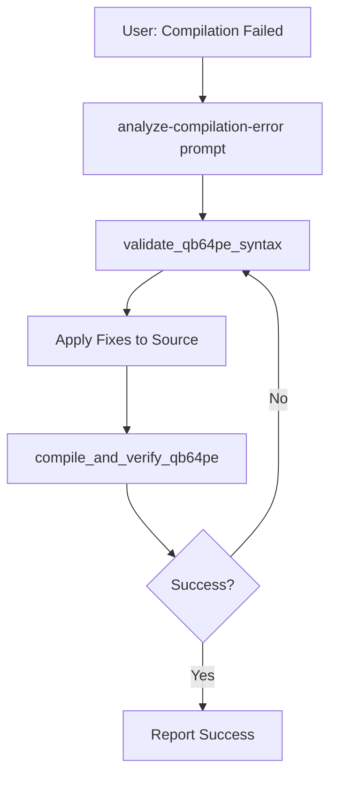

# analyze-compilation-error

**Intelligent compilation error analysis and autonomous fix workflow for QB64PE programs.**

## 📋 **Overview**

This prompt provides **context-aware guidance** when QB64PE compilation fails. It analyzes terminal output, identifies errors, recommends specific MCP tools, and guides agents through autonomous fix workflows.

**Use this prompt when:**
- User shows terminal output from failed QB64PE compilation
- User references `#qb64pe` with terminal commands
- Compilation errors need analysis and fixes
- Agent is unsure which tools to use for compilation errors

## 🔧 **Parameters**

| Parameter | Type | Required | Description |
|-----------|------|----------|-------------|
| `terminalOutput` | string | ✅ | Complete terminal output from failed compilation |
| `sourceFilePath` | string | ✅ | Absolute path to the .bas file that failed to compile |
| `errorContext` | string | ❌ | Additional context about what the user was trying to do |

## 🎯 **Intelligent Workflow**

The prompt generates a **complete autonomous action plan** including:

### 1. **Error Pattern Recognition**
Identifies specific error types and maps them to solutions:

```
Error Pattern: "Expected declaration"
→ Tool: validate_qb64pe_syntax
→ Action: Check variable declarations and type annotations

Error Pattern: "Type mismatch"  
→ Tool: validate_qb64pe_compatibility
→ Action: Verify type consistency and fix declarations

Error Pattern: "Syntax error in line X"
→ Tool: validate_qb64pe_syntax
→ Action: Parse line X, identify syntax violation, apply fix

Error Pattern: "FUNCTION/SUB not found"
→ Tool: validate_qb64pe_syntax
→ Action: Check function declarations and call signatures
```

### 2. **Autonomous Action Plan**
Step-by-step plan agents should execute **WITHOUT asking user**:

```markdown
## AUTONOMOUS ACTION PLAN

### Step 1: Pre-Analyze with MCP Tools
- Call `validate_qb64pe_syntax` with source code
- Review errors and suggestions

### Step 2: Apply Targeted Fixes
- Edit source file based on error analysis
- Focus on line numbers mentioned in terminal output

### Step 3: Verify with Compilation
- Call `compile_and_verify_qb64pe` 
- Check result.success and result.errors

### Step 4: Iterate if Needed
- If result.success = false, analyze new errors
- Apply additional fixes
- Repeat until result.success = true

### Step 5: Report Success
- Inform user compilation succeeded
- Provide executable path
```

### 3. **Tool Decision Matrix**
Clear guidance on **which tool to use when**:

| If Terminal Shows | Use This Tool | For This Purpose |
|-------------------|---------------|------------------|
| Syntax errors with line numbers | `validate_qb64pe_syntax` | Pre-check syntax before recompiling |
| Type mismatch errors | `validate_qb64pe_compatibility` | Check type consistency |
| "QB64PE not found" | `detect_qb64pe_installation` | Find QB64PE installation |
| Multiple errors of same type | `compile_and_verify_qb64pe` | Get structured error list |
| Need to verify fix | `compile_and_verify_qb64pe` | Test if changes work |
| Porting-related errors | `port_qbasic_to_qb64pe` | Re-port with better patterns |

### 4. **Context-Aware Error Analysis**
Analyzes terminal output and provides **specific** guidance:

```typescript
// Example error analysis
{
  "errorType": "SYNTAX_ERROR",
  "errorLine": 42,
  "errorMessage": "Expected END FUNCTION",
  "recommendation": {
    "tool": "validate_qb64pe_syntax",
    "action": "Check function definition at line 42 - likely missing END FUNCTION",
    "fix": "Add 'END FUNCTION' after function body",
    "verifyWith": "compile_and_verify_qb64pe"
  }
}
```

## 💡 **Example Usage Scenarios**

### Scenario 1: User Pastes Terminal Output
```
User: "I tried to compile test.bas and got this error:
Line 15: Type mismatch - cannot assign STRING to INTEGER
#qb64pe"

Agent Response:
[Uses analyze-compilation-error prompt]

1. Analyzing error: Type mismatch at line 15
2. Calling validate_qb64pe_syntax to confirm issue
3. Found: Variable 'count' declared as INTEGER but assigned string value
4. Fixing: Changing assignment from "count = \"5\"" to "count = 5"
5. Verifying: Calling compile_and_verify_qb64pe
6. ✅ Compilation successful! Executable created at /path/to/test
```

### Scenario 2: Multiple Errors
```
User: "Compilation failed with 5 errors, here's the output:
[terminal output]
#qb64pe"

Agent Response:
[Uses analyze-compilation-error prompt]

Analyzing 5 compilation errors:
1. Line 10: Missing DIM statement
2. Line 15: Type mismatch
3. Line 22: Undeclared function
4. Line 30: Missing END SUB
5. Line 45: Syntax error in PRINT

Autonomous fix plan:
Step 1: Adding DIM statements (fixing errors 1, 3)
Step 2: Fixing type issues (error 2)  
Step 3: Adding END SUB (error 4)
Step 4: Correcting PRINT syntax (error 5)
Step 5: Compiling to verify all fixes

[Executes plan autonomously]

✅ All 5 errors fixed, compilation successful!
```

### Scenario 3: Recurring Error After Fix
```
User: "I fixed the error but it's still not compiling
#qb64pe terminal_last_command"

Agent Response:
[Uses analyze-compilation-error prompt]

Analyzing new compilation attempt:
- Previous fix was incomplete
- Error moved from line 15 to line 18
- Root cause: Similar issue in different function

Comprehensive fix strategy:
1. Searching entire file for same pattern
2. Applying fix to all occurrences (3 found)
3. Verifying with compile_and_verify_qb64pe
4. ✅ Success after comprehensive fix
```

## 🧠 **Agent Intelligence Patterns**

### Pattern 1: Recognize Compilation Context
```typescript
// Agent should recognize these signals:
const compilationContextSignals = [
  "compilation failed",
  "compile error",
  "Line X: Error",
  "#qb64pe" + terminal reference,
  ".bas file" + error message,
  "qb64pe" command + error output
];

// Action: Use analyze-compilation-error prompt
```

### Pattern 2: Terminal Output Analysis
```typescript
// Agent should extract:
{
  "command": "qb64pe -c test.bas",
  "exitCode": 1,
  "errorLines": [
    { "line": 15, "message": "Type mismatch", "severity": "error" }
  ],
  "sourceFile": "/path/to/test.bas"
}

// Action: Call appropriate MCP tools based on error types
```

### Pattern 3: Autonomous Iteration
```typescript
// Agent should automatically:
1. Analyze terminal output
2. Identify errors
3. Apply fixes
4. Compile again
5. Check results
6. REPEAT until success or max iterations

// NO USER PROMPTING between steps!
```

## 🔄 **Workflow Automation**

### Fully Autonomous Workflow
```markdown
## Agent Execution (No User Intervention)

1. **Receive**: User shows compilation error
2. **Recognize**: Compilation context detected
3. **Analyze**: Parse terminal output for errors
4. **Plan**: Generate fix strategy
5. **Execute**: Apply all fixes
6. **Verify**: Compile with compile_and_verify_qb64pe
7. **Iterate**: If errors remain, go to step 4
8. **Report**: Only report final success/failure to user
```

### Tools Used in Sequence


## 📊 **Error-to-Tool Mapping**

### Common Error Patterns and Solutions

#### Type Errors
```json
{
  "pattern": "Type mismatch|Cannot assign|Type incompatible",
  "tools": ["validate_qb64pe_syntax", "validate_qb64pe_compatibility"],
  "action": "Check variable declarations, verify type consistency",
  "verify": "compile_and_verify_qb64pe"
}
```

#### Declaration Errors
```json
{
  "pattern": "Variable .* not declared|Undeclared|DIM required",
  "tools": ["validate_qb64pe_syntax"],
  "action": "Add DIM statements, check variable scoping",
  "verify": "compile_and_verify_qb64pe"
}
```

#### Structure Errors
```json
{
  "pattern": "Expected END|Missing END|Unexpected END",
  "tools": ["validate_qb64pe_syntax"],
  "action": "Check SUB/FUNCTION/IF/FOR block closures",
  "verify": "compile_and_verify_qb64pe"
}
```

#### Porting Errors
```json
{
  "pattern": "Not supported in QB64PE|Legacy syntax|QBasic compatibility",
  "tools": ["port_qbasic_to_qb64pe", "validate_qb64pe_compatibility"],
  "action": "Re-port code with modern QB64PE patterns",
  "verify": "compile_and_verify_qb64pe"
}
```

## 🎓 **Training for Agents**

### Key Concepts Agents Must Learn

1. **Terminal Output Contains Everything**
   - Error messages have line numbers
   - Error types indicate which tools to use
   - Exit codes indicate success/failure

2. **MCP Tools Are Your Solution**
   - Don't guess - use `validate_qb64pe_syntax` first
   - Always verify with `compile_and_verify_qb64pe`
   - Iterate until success

3. **Be Autonomous**
   - Don't ask "should I fix this?"
   - Don't say "I suggest you fix..."
   - FIX IT and report results

4. **Use Error Context**
   - Line numbers tell you where to look
   - Error messages tell you what's wrong
   - MCP tools tell you how to fix it

### Anti-Patterns to Avoid

❌ **DON'T**: "Let me know if you want me to fix this"
✅ **DO**: Fix it automatically and report results

❌ **DON'T**: "The error is at line 15"
✅ **DO**: "Fixed type mismatch at line 15, recompiling..."

❌ **DON'T**: Stop after first fix
✅ **DO**: Continue iterating until compilation succeeds

❌ **DON'T**: Guess what's wrong
✅ **DO**: Use `validate_qb64pe_syntax` to analyze

## 🚀 **Agent Decision Tree**

```
Compilation Error Detected?
├─ Yes
│  ├─ Call validate_qb64pe_syntax
│  ├─ Analyze errors
│  ├─ Apply fixes
│  ├─ Call compile_and_verify_qb64pe
│  └─ success?
│     ├─ Yes → Report success
│     └─ No → Loop back to analyze errors
└─ No
   └─ Continue normal operation
```

## 💾 **Prompt Response Format**

When this prompt is invoked, it returns:

```markdown
# QB64PE Compilation Error Analysis

## Error Summary
- **Total Errors**: 3
- **File**: /path/to/source.bas  
- **Error Types**: Type mismatch (1), Missing declaration (1), Syntax error (1)

## Autonomous Fix Plan

### Error 1: Type Mismatch (Line 15)
- **Issue**: Cannot assign STRING to INTEGER variable 'count'
- **Fix**: Change `count = "5"` to `count = 5`
- **Tool**: validate_qb64pe_syntax → compile_and_verify_qb64pe

### Error 2: Missing Declaration (Line 22)
- **Issue**: Variable 'total' used before declaration
- **Fix**: Add `DIM total AS INTEGER` before line 22
- **Tool**: validate_qb64pe_syntax → compile_and_verify_qb64pe

### Error 3: Syntax Error (Line 30)
- **Issue**: Missing END SUB
- **Fix**: Add `END SUB` after line 35
- **Tool**: validate_qb64pe_syntax → compile_and_verify_qb64pe

## Execution

[Agent automatically executes all fixes]

1. ✅ Fixed type mismatch at line 15
2. ✅ Added DIM statement at line 21
3. ✅ Added END SUB at line 36
4. 🔄 Compiling with compile_and_verify_qb64pe...
5. ✅ **Compilation Successful!**
   - Executable: /path/to/source
   - Iterations: 1
   - Time: 2.3 seconds

## Summary
All 3 errors fixed autonomously. Program compiled successfully.
```

---

**See Also:**
- [debug-qb64pe-issue](./debug-qb64pe-issue.md) - General debugging guidance
- [compile_and_verify_qb64pe](../tool-docs/compile_and_verify_qb64pe.md) - Compilation verification tool
- [validate_qb64pe_syntax](../tool-docs/validate_qb64pe_syntax.md) - Syntax validation tool
